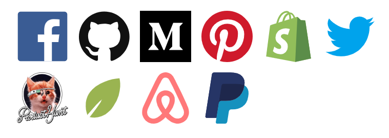
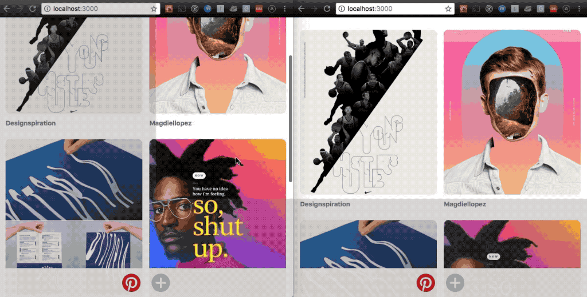
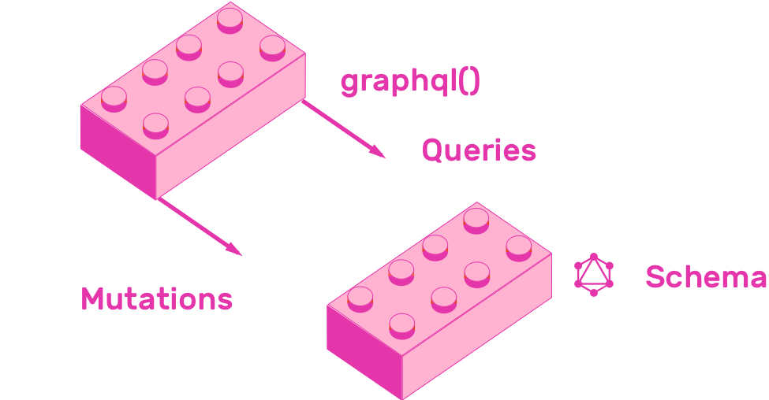
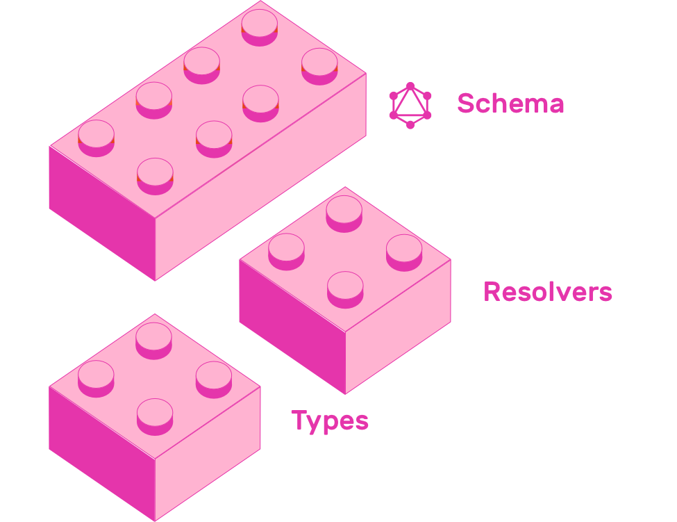
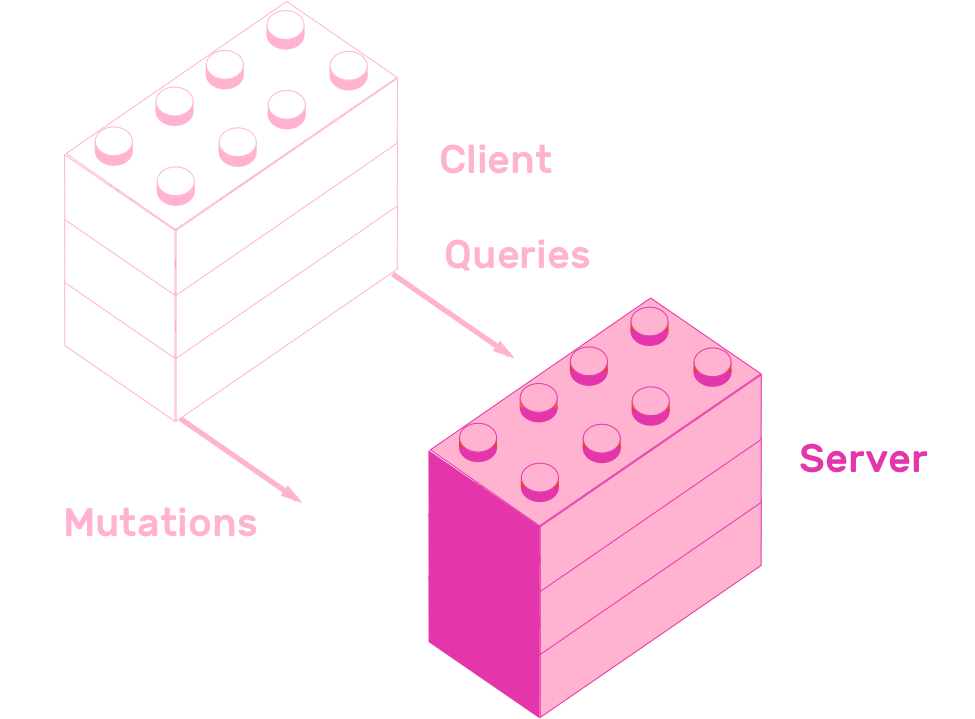
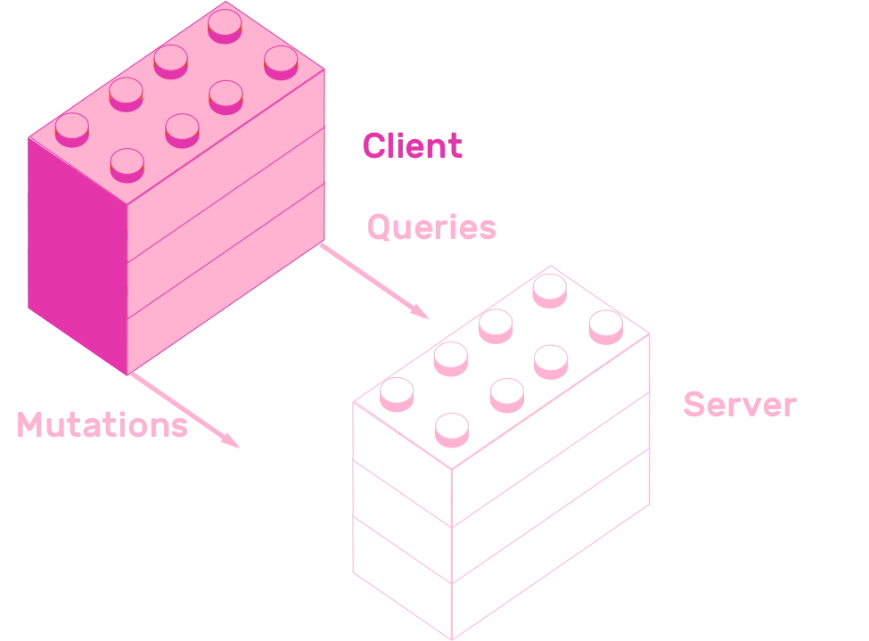
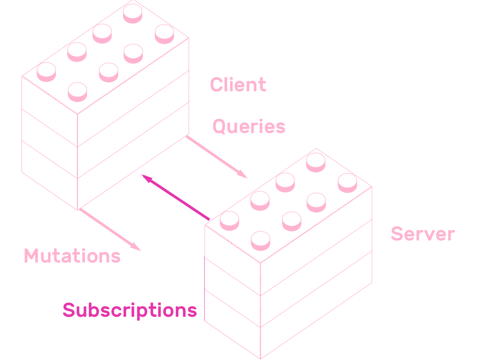

import { Notes } from 'mdx-deck'
export { components } from "mdx-deck-code-surfer"
import GraphQLBurger from "./components/GraphQLBurger"
import FullWidth from "./components/FullWidth";
import BookLogo from "./components/BookLogo";
import Playground from "./components/Playground";

# Fullstack GraphQL


---

Hola 👋

---

# Sobre mi

* 👨‍🎓 [Universidad de Mendoza](http://www.um.edu.ar/en/)
* 👨‍💻 [GraphCMS](https://graphcms.com/)
* ✍ [GraphQL College](https://www.graphql.college/)
* 📖 [Fullstack GraphQL](https://www.graphql.college/fullstack-graphql/)

---

# Por qué GraphQL?

---

# ✨ Experiencia de desarrollo ✨

---

* 📖 Documentación automática
* 🎮 Control sobre payload
* 🔢 Versionado
* 🛠 Herramientas desarrollo

---

## Por qué GraphQL?

* 🌪 Consumir APIs es difícil
* ⚡ Errores, tiempo, pérdida de clientes
* ☀️ GraphQL ofrece excelente experiencia de desarrollo

---

* 👩‍💻 Empresas con clientes desarrolladores
* ⚡ Empresas buscando eficiencia de desarrollo
* 📱 Aplicaciones mobile

---

## Empresas que usan GraphQL



---

# Qué es GraphQL?

---

## 🔎 Lenguaje de consulta para tu API

<Notes>
  query -> JSON
</Notes>

---

## ✨ Excelente experiencia de desarrollo ✨

* 📖 Documentación automática
* 🎮 Control sobre payload
* 🔢 Versionado
* 🛠 Herramientas desarrollo

---

## 📖 Documentación automática

* 🌪 APIs REST son dificiles de documentar
* ⚡ Dificil comunicación entre equipo cliente y servidor
* ☀️ APIs GraphQL proveen documentación automática
* 💡 Descripción de datos completa y entendible mejora productividad

---

<Playground endpoint="https://api-euwest.graphcms.com/v1/cjjrhurmx057h01buasfnr6sl/master" />

---

## 🎮 Control sobre payload

* 🌪 APIs REST determinan la forma de los datos en cada endpoint
* ⚡ Esto puede ocasionar pedidos con información innecesaria
* ☀️ APIs GraphQL permiten a los clientes pedir exactamente lo que necesitan
* 💡 Aplicaciones mas eficientes. Payloads menores y menos requests

---

<FullWidth>
  <GraphQLBurger defaultQuery={`{
    burger {
      bun(type: simple)
      patty(type: tripleMeat)
      topping {
        cheese(type: simple)
        egg
        lettuce
        tomato
        bacon
      }
    }
  }
  `} />
</FullWidth>

---

## 🔢 Versionado

* 🌪 APIs REST usan versionado para ofrecer nuevos features
* ⚡ Mantener las diferentes versiones de una API y comunicar los cambios es una tarea dificil
* ☀️ GraphQL facilita evolucionar APIs a través del tiempo
* 💡 Evitás breaking changes porque clientes piden exactamente lo que quieren

<Notes>
* Sin embargo cualquier cambio en una API REST es un breaking change
* no mas /api/v1
</Notes>

---

```graphql
type Pelicula {
  titulo: String
  episodio: Int
  fechaEstreno: String


}
```

---

```graphql
type Pelicula {
  titulo: String
  episodio: Int
  fechaEstreno: String
  introduccion: String


}
----
5
```

---

```graphql
type Pelicula {
  titulo: String
  episodio: Int
  fechaEstreno: String
  introduccion: String
  director: String

}
----
6

---

```graphql
type Pelicula {
  titulo: String
  episodio: Int
  fechaEstreno: String
  introduccion: String
  director: String
  dirigidaPor: Persona
}

type Persona {
  nombre: String
  dirigio: [Pelicula]
  actuoEn: [Pelicula]
}
----
6:14
```

---

```graphql
type Pelicula {
  titulo: String
  episodio: Int
  fechaEstreno: String
  introduccion: String
  director: String @deprecated
  dirigidaPor: Persona
}

type Persona {
  nombre: String
  dirigio: [Pelicula]
  actuoEn: [Pelicula]
}
----
6
```

---

## 🛠 Herramientas desarrollo

* 🌪 APIs REST generalmente no siguen un estandard de modelado de datos
* ⚡ Difícil generar herramientas que faciliten desarrollo
* ☀️ APIs GraphQL exponen estructura interna

---

## 🛠 Herramientas desarrollo

* ⚙ Clientes inteligentes
* 🤖 Generación de código
* 📊 Visualización

---

## Cómo usar GraphQL?

---

<a href="https://www.graphql.college/fullstack-graphql/" target="_blank">
  <BookLogo style={{ height: "50vh" }} />
</a>

---



---

## 1. Escribir/Leer datos



---

## 2. Diseñar esquema



---

## 3. Servidor NodeJS



---

## 4. Cliente React



---

## 5. Suscripciones



---

## 6. Testing

🙀

---

# Conclusión

* 🔎 Lenguaje de consulta para tu API
* ✨ Experiencia de desarrollo ✨

---

# Preguntas❓

---

# 🙏 Gracias 🙏

---

# A su disposición

julian@graphql.college

---

## Enlaces útiles

* [github.com/GraphQLCollege/charla-fullstack-graphql](https://github.com/GraphQLCollege/charla-fullstack-graphql)
* [graphql.college/fullstack-graphql](https://www.graphql.college/fullstack-graphql/)

---

## Enlaces útiles

* [graphql.org](https://graphql.org)
* [graphcms.com](https://graphcms.com/)
* [apollographql.com/](https://www.apollographql.com/)